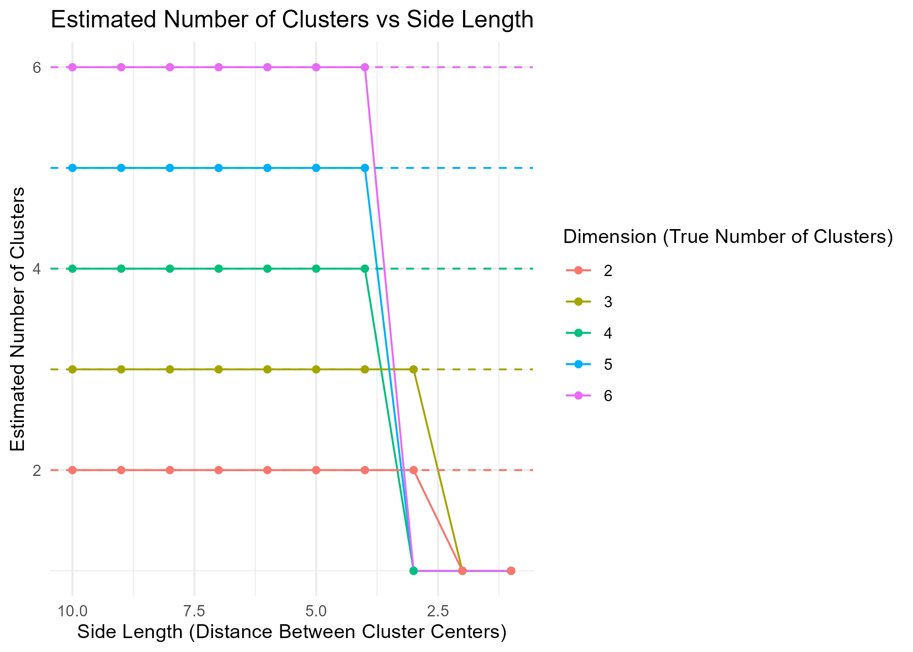
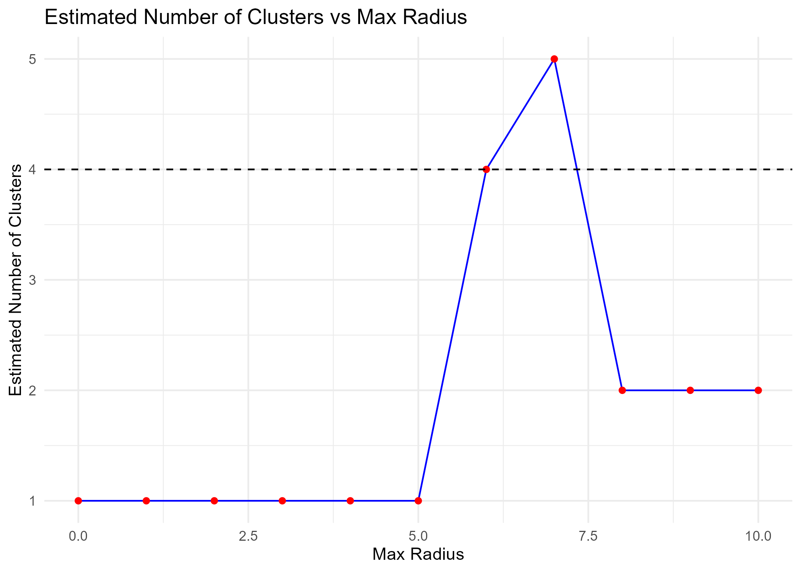

```{r setup, include=FALSE}
knitr::opts_chunk$set(echo = TRUE)
library(cluster)   
library(tidyverse)
library(plotly)
```

# Task 1

```{r, task1-simulation}
read_csv("derived_data/task1_results.csv")
```

```{r, task1-plot}

```

For each dimension n, the Gap Statistic method reliably estimates the correct number of clusters when the centers are sufficiently far apart. The estimated number of clusters remains close to the true number n when the side length is large.
We observe that the estimated number of clusters begins to drop below the true number of clusters between side length 3 and 4. 

# Task 2
```{r, task2-sampledata}
# Test the function
read_csv("derived_data/task2_test.csv")
```

```{r, task2-sampleplot}
# Interactive 3D scatter plot with plotly
knitr::include_url("figures/task2_testplot.html")
```

```{r, task2-simulation}
read_csv("derived_data/task2_simulation.csv")
```

```{r, task2-plot}

```
The algorithm doesn't consistently detect the correct number of clusters. As the maximum radius decreases, the number of clusters identified decreases as well. The failure point is around radius of 4, where the shells starts overlapping and the algorithm can't distinguish between them anymore. If we were to decrease the threshold, the algorithm would fail earlier because the adjacency graph would become disconnected sooner. If we were to increase the threshold, the algorithm could do a better job at detecting the correct number of clusters but risks merging shells if set too high. 